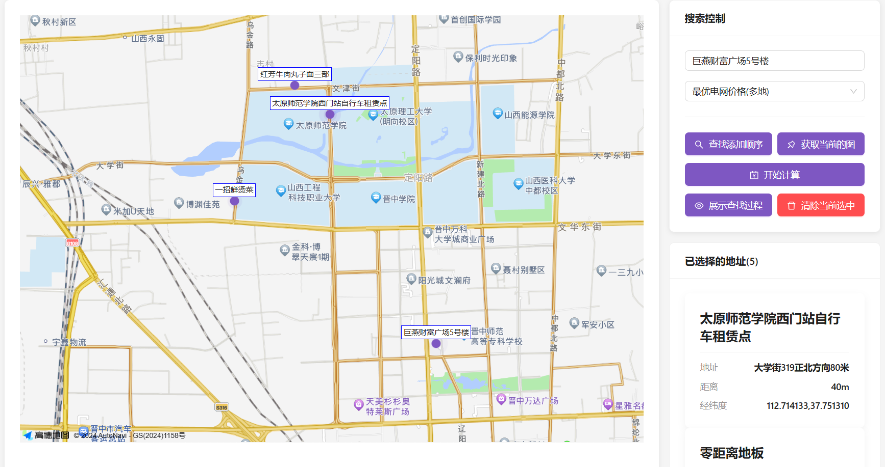
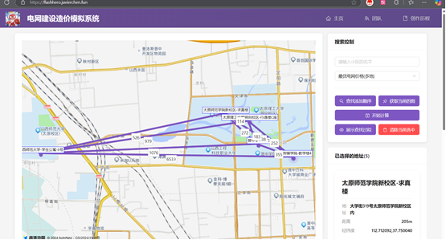

<h1  
style="background: linear-gradient(45deg, #9c27b0, #673ab7); 
       -webkit-background-clip: text;
       -webkit-text-fill-color: transparent;
       display: inline-block;
       font-weight: bold
       "
>
电网建设造价模拟系统
</h1>

<p >
  
  
  
  
  
</p>


## 项目展示


## 项目启动


> PS: 如果你的电脑上没有安装 node 18 及以上的版本，请记得安装  <br /> <br />
> 如果你电脑上无法安装，有一种方式供你进行查看  <br />
> 方式一： 访问我们部署好的网站 [电网建设造价模拟系统](https://flashhero.javierchen.fun/)   <br />


### 1. 在命令行中进入项目目录

```sh
cd 代码夹
```

### 2. 安装依赖

```sh
npm install
```

### 3. 启动项目

```sh
npm run dev
```

### 4. 浏览器访问

http://localhost:5173/

### 项目使用

#### 标记点位
()

#### 展示图的权值


#### 最优的路径(动图)

